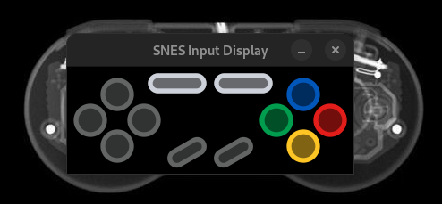

# Snes controller input display
Displays your SNES input reading directly from the console data, built in Rust with ggez.

Completely compatible with the [RetroSpy](https://retro-spy.com) Skin format for Super Nintendo controllers.

You can find great skins here: https://github.com/developwisely/squabbler-retrospy-nintendospy-skins
image.png





## Requirements
- [QUsb2Snes](https://skarsnik.github.io/QUsb2snes/) or [SNI](https://github.com/alttpo/sni)
- Sd2Snes or FxPak Pro for original hardware

## Configuration
Requires a configuration file named "settings.toml" at this location:
- Windows: %localappdata%\snes-input-display\
- MacOs: $HOME/Library/Application Support/snes-input-display
- Linux: $HOME/.config/snes-input-display

Paths must be in between single quotes
```toml
[skin]
# skins_path: Folder where all your Retrospy skins are stored
# skins_path = '/home/example/Documents/squabbler-retrospy-nintendospy-skins/skins'
skins_path = 'C:\Users\example\Documents\squabbler-retrospy-nintendospy-skins\skins'
# skins_name: Folder name of the skin you want to use
skin_name = "snes-super-famicom-squabbler"
# skins_theme = value of '<background name> you want to use, found in the theme's xml file'
# ex: <background name="Black" image="input-display-overlay-famicom.png" />
skin_theme = "Black"

```
A settings file example can be found [here](https://github.com/ChTBoner/snes_input_display)


## Game List Working with Defaults.json
You should try with Defaults.json
If not working, you can try to figure it out with an Emulator like Bizhawk

- Aladdin
- Axelay
- Castlevania Dracula X
- Contra 3
- Double Dragon V
- F-Zero
- Fatal Fury 1, 2, Special
- Final Fight 1, 2 and Guy (Not Final Fight 3)
- Illusion of Gaia
- Killer Instinct
- Lufia II - Rise of the Sinistrals
- Lufia, The Fortress of Doom
- Mortal Kombat 1, 3 (Not 2)
- NBA JAM (included Tournament Edition)
- NBA Live 95, 96, 97, 98
- NBA Showdown
- Secret of Mana
- Super Castlevania IV
- Super Ghouls n'Ghosts
- Super Mario Kart
- Super Mario World
- Super Metroid
- The Blues Brothers
- The Legend of Zelda: A Link to the Past
- The Lion King

- SMZ3 Randomizers

Please tell me games that also work so I can add them to the list or if you figure out other layouts

### Controller config file
The controller config file must be in the json format
```json
{
    // location in WRAM where input data, sadly not in hex format.
    "address": "F90718",
    // size in bytes of the input data
    "size": 2,
    // location of each button in the array of bits provided by usb2snes
    "button_layout": 
        {
            "a": 0,
            "x": 1,
            "b": 8,
            "y": 9,
            "select": 10,
            "start": 11,
            "up": 12,
            "down": 13,
            "left": 14,
            "right": 15,
            "l": 2,
            "r": 3
        }
}
```

Will not work with Super FX and SA-1 games

## TROUBLESHOOTING
SNI or QUSB2SNES must be up and running and connected to a powered on console.

## Credits
[Skarsnik](https://github.com/Skarsnik)

https://github.com/developwisely/squabbler-retrospy-nintendospy-skins


## TODO
- Configuration via GUI
- Better error management
- Default setup on startup

GNU GPLv3