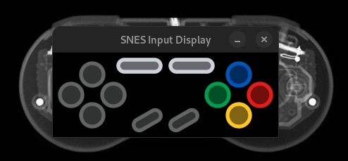

# SnITCH - Snes Input Tracking Controller HUD



Displays your SNES input reading directly from the console data. built in Rust with [ggez](https://ggez.rs).

Completely compatible with the [RetroSpy](https://retro-spy.com) Skin format for Super Nintendo controllers.

Note: the USB handling of the FxPax/Sd2Snes has up to five frames of jitter at all times.
you'll need a hardware device like a RetroSpy.
If you're using one of those flash carts and you want an input display that is more accurate than that,

## Requirements

### Software

- [QUsb2Snes](https://skarsnik.github.io/QUsb2snes/) or [SNI](https://github.com/alttpo/sni)
- Sd2Snes or FxPak Pro for original hardware

NOTE: Tested working with:

- [snes9x-emunwa](https://github.com/Skarsnik/snes9x-emunwa)
- [bsnes-plus](https://github.com/black-sliver/bsnes-plus.git) but NOT with the Default layout.

### Configuration File

A configuration file named "settings.toml" at this location (see below for details):

- Windows: %localappdata%\snes-input-display\
- MacOS: $HOME/Library/Application Support/snes-input-display
- Linux: $HOME/.config/snes-input-display

### Skins

Retrospy compatible skins.

You can find great skins here:

- <https://github.com/developwisely/squabbler-retrospy-nintendospy-skins>
- <https://proximitysound.itch.io/skins>

## Configuration

If no configuration file is found at startup,
it will create a file with default values at the location stated above, and exit.

It will not work until all is correct in the configuration file.

Paths must be in between single quotes

```toml
[controller]
# input_config_path: Path to read for input memory addresses (you can copy paste the contents of )
input_config_path = 'D:\Documents\snes-input-display\inputs_addresses.json'
layout = "Default"

[skin]
# skins_path: Folder where all your Retrospy skins are stored
# skins_path = '/home/example/Documents/squabbler-retrospy-nintendospy-skins/skins'
skins_path = 'C:\Users\example\Documents\squabbler-retrospy-nintendospy-skins\skins'
# skins_name: Folder name of the skin you want to use
skin_name = "snes-super-famicom-squabbler"
# skins_theme = value of '<background name> you want to use, found in the theme's xml file'
# ex: <background name="Black" image="input-display-overlay-famicom.png" />
skin_theme = "Black"

# the usb2snes parameters are not required,
# but can be used to connect to a non localhost usb2snes endpoint
[usb2snes]
address = "127.0.0.1"
port = 23074

```

A settings file example can be found here: [confs/settings.toml](./confs/settings.toml)

### For Linux and MacOS

Dont forget to set the correct permission on the file to allow it to execute

```sh
$ cd /path/to/snes_input_viewer/folder
# Linux
$ chmod +x snes_input_display_linux_amd64
# MacOS
$ chmod +x snes_input_display_mac_amd64
```

## Keyboard shortcurts (aka. Your introduction to vim motions... :D)

- j = select next entry in the layouts from the controller config file
- k = select previous entry in the layouts from the controller config file
- h = select the previous available retroskin
- l = select the next available retroskin
- b = select the next available background for your chosen Retroskin

> [!WARNING]
> Changing skin under Wayland is buggy and might not work as expected.

## Game List Working with the Defaults layout

You should try with the Default Layout if you're on the Sd2Snes/FxPakPro. It will NOT work with an emulator
The F90718 address doesn't work on emulator.

If not working, you can try to figure it out with an Emulator like Bizhawk

- Aladdin
- Axelay
- Castlevania Dracula X
- Contra 3
- Double Dragon V
- F-Zero
- Fatal Fury 1, 2, Special
- Final Fight 1, 2 and Guy (Not Final Fight 3)
- Illusion of Gaia
- Killer Instinct
- Lufia II - Rise of the Sinistrals
- Lufia, The Fortress of Doom
- Mortal Kombat 1, 3 (Not 2)
- NBA JAM (included Tournament Edition)
- NBA Live 95, 96, 97, 98
- NBA Showdown
- Secret of Mana
- Super Castlevania IV
- Super Ghouls n'Ghosts
- Super Mario Kart
- Super Mario World
- Super Metroid
- The Blues Brothers
- The Legend of Zelda: A Link to the Past
- The Lion King
- SMZ3 Randomizers
- ...

This list is in no way complete.
Please tell me games that also work so I can add them to the list or if you figure out other layouts

Will not work with Super FX and SA-1 games. (Star Fox, Yoshi's Island...).

Super Metroid Hacks: if no inputs are showing on the display with the Default layout, try with the "Super Metroid Emu" layout

### Controller config file

The controller config file must be in the json format

```json
{
    "layouts": {
        "Default": {
            "address_low": "F90718",
            "address_high": "F90719"
        },
        "Super Mario World": {
            "address_low": "F50DA4",
            "address_high": "F50DA2"
        },
        "Ninja Gaiden Trilogy": {
            "address_low": "F5127A",
            "address_high": "F5127B"
        }
    }
}
```

You can add addresses to the file for your game if needed.
The RAM Search tools of Bizhawk are great to find the values.

An example file can be found here: [confs/Defaults.json](./confs/Defaults.json)

## TROUBLESHOOTING

Make sure all paths and info are correct in the configuration file.

## Credits

[Skarsnik](https://github.com/Skarsnik)

<https://github.com/developwisely/squabbler-retrospy-nintendospy-skins>

GNU GPLv3
